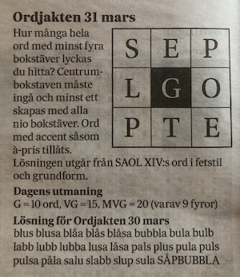

# Word hunt

Word hunt is a word puzzle game that is based on 'Ordjakten' which is published daily in the swedish Newspaper, Svenska Dagbladet. The objective with the printed game is to find as many words with at least four letters (where on e should be the the letter in the black square in the middle). In this version of the game, the objective is to use all nine letters to construct a valid word. 

The live link can be found here - [Word Hunt](https://andersganander.github.io/word_hunt/)

## Site Owner Goals 
- To 

## User Stories
- ### First time user
  - As a first time user I want to 

- ### Returning User
  - As a returning user I want to 

- ### Frequent User
  - As a frequent user I want to 

## Design

### Imagery

### Colors

### Fonts

## Wireframes
Wireframes were produced using Balsamiq. 

 

 
Desktop Wireframe

 

 

    
Mobile Wireframe

 

## Features
- ### Navigation

    - The 

- ### The Start Screen
    - The 

 

- ### How to play screen
    - On the 

 
  
- ### High score screen
    - The E

 

## Testing

### Validator Testing
- #### HTML
    - The site was tested with W3C Markup Validation Service, without any errors.

- #### CSS
    -  The site was tested with W3C CSS Validator, without any errors.

- #### Accessibility 
    - The site was tested for accessibility with Ligthouse and received a good result.

### User story testing
The tests has been done with Chrome on macOs

### Browser Testing
The site were tested in the most common browsers (Chrome, Firefox, Safari and Edge). Alll browsers were tested on mac os except for Edge which was tested on Windows 11.

    
### Device Testing
In addition to testing responsiness with Am I Responsive and Responsinator the site has also been tested on some ios devices (iPhone SE and iPad). 

### Fixed Bugs
All the bugs that were discovered during the development have been documented using GitHub issues. 

### Known Bugs
- 

## Technologies Used

### Languages
- HTML5
- CSS
- Javascript

### Frameworks - Libraries - Programs Used
#### Development and design
- [Balsamiq](https://balsamiq.com/) - Used to create wireframes for desktop and mobile.
- [Chrome Dev Tools](https://developer.chrome.com/docs/devtools/) - Used for overall development and testing.
- [GitHub](https://github.com/) - Used for version control and hosting.

#### Testing
- [Am I Responsive](http://ami.responsivedesign.is/) - Used to verify responsiveness.
- [Lighthouse](https://developer.chrome.com/docs/devtools/) - Used for overall accessibility testing from dev tools.
- [Responsinator](http://www.responsinator.com/) - Used to verify responsiveness.
- [W3C](https://www.w3.org/) - Used for validation of HTML and CSS.

## Deployment

The project was deployed using GitHub pages. The steps to deploy using GitHub pages are:

1. Go to the repository on GitHub.com
2. Select 'Settings' near the top right corner of the page.
3. Select 'Pages' from the menu bar on the left of the page.
4. Click the drop down below 'Source' and select 'Deploy from a Branch'.
5. Click the drop down under 'Branch' and select 'main'.
5. Click 'Save'.

At the top of the page there's a section describing the status of your site and when it was last deployed. 
To remove the project from auto-deploy:
Repeat step 1-2 in the above list, then click the drop down under 'Branch' and select 'None'. Click 'Save'.

The live link can be found here - [REAL Records](https://andersganander.github.io/word_hunt/)

## Credits

### Content
All texts was written by the site owner.

### Media
#### Photos
- Photo

#### Fonts and icons
- 
- [Font Awesome](https://fontawesome.com/) used for icons in footer and event cards
- [Freefavicon](https://www.freefavicon.com/) used for creating favicon.

### Resources Used
- Love Math walkthrough for inspiration, especially how to .
- [Mmdn](https://developer.mozilla.org/en-US/docs/Web/CSS) for tutorials, tips and tricks
- [w3Schools] (https://www.w3schools.com/) for tutorials, tips and tricks. 

## Acknowledgments
-