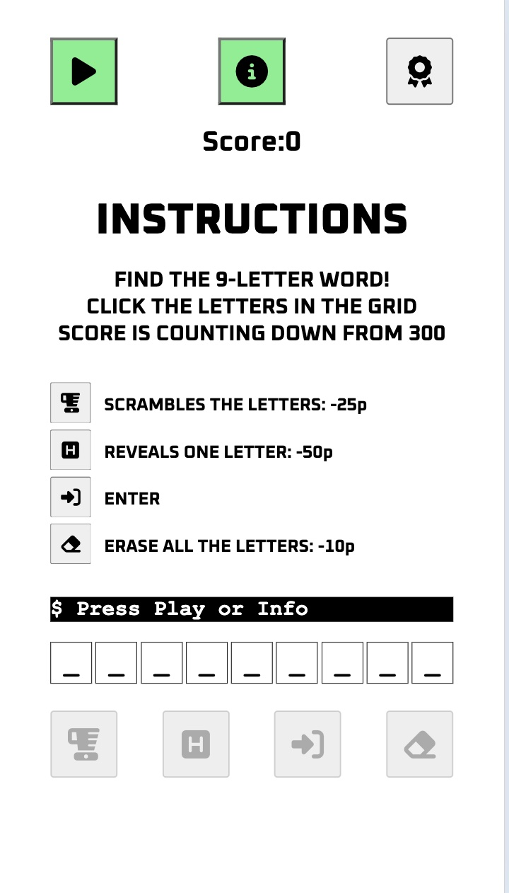
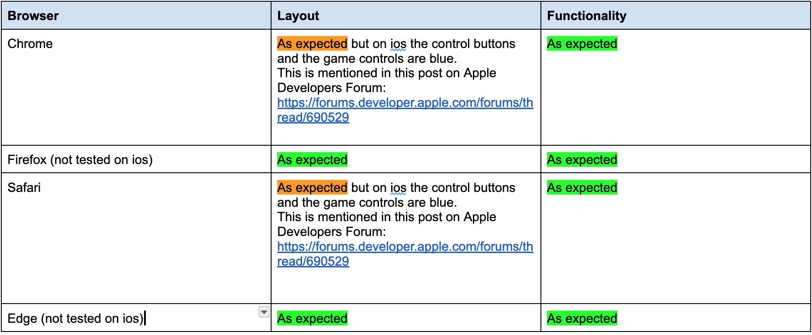

# Word hunt

Word hunt is a word puzzle game that is based on 'Ordjakten' which is published daily in the swedish Newspaper, Svenska Dagbladet. The objective with the printed game is to find as many words with at least four letters (where one should be the the letter in the black square in the middle). In this version of the game, the objective is to use all nine letters to construct a valid word. To help the user, there are two different aids to facilitate the hunt for the hidden word. Each time the user uses one of these aids, the score is decreased.

The focus has been on creating an appealing game with a sleek and simple design that uses interactivity to enhance the gaming experience. For example, the background color of the selected letter changes, or a message appears when a help function is used or the correct word is guessed. By offering help functions that users can use at the cost of points, their motivation to play again increases as they figure out the best way to use these functions to improve their score. How long should one wait before using the help functions? Which help suits me best? Is it easier to see the word when the letters are shuffled? Saving and displaying the user's highest score on a leaderboard also increases their desire to return.

The live link can be found here - [Word Hunt](https://andersganander.github.io/word_hunt/)

## Site Owner Goals 
- As a site owner, I aim to provide users with an exciting and smooth gaming experience that encourages them to return to my site.

## User Stories
- ### First time user
  - As a first time user I want to quickly understand what the game is about and how to play.

- ### Returning User
  - As a returning user I want to be able to start the game without having to read instructions.
  - As a returning user I want to have the possibility to read the instructions if i need to.

- ### Frequent User
  - As a frequent user I want to check the high score to see if i still have the highest score.
  - As a frequent user I want to try different game playing strategys to find out the best way to get a high score.

## Design
The design of the application serves two main objectives. Firstly, it aims to closely replicate the aesthetic of the printed version of the game in "Svenska Dagbladet," particularly in the way the letters are arranged within a grid. Secondly, the design prioritizes user-friendliness, especially for mobile phone users. To achieve this, the interface is intentionally minimalist, featuring intuitive icons that guide the user effortlessly through the game. The color scheme is limited to a few shades to avoid visual clutter, and the text is concise, ensuring that the gameplay is straightforward and accessible. This combination of a familiar aesthetic with a streamlined functionality makes the game engaging and easy to navigate on smaller screens.

### Colors
The number of colors has been deliberately kept to a minimum in the design. The reason behind this choice of colors is partly to promote readability and clarity through strong contrasts, such as black on white or white on black. However, it also involves leveraging the signaling value of certain colors. For instance, two of the buttons on the startup screen are green to guide first-time users to the most important functions (starting the game and reading instructions). The colors on the leaderboard are chosen to create a game-like atmosphere, utilizing colors and fonts commonly seen on high score lists. The user's score is highlighted in a bright yellow-green color to make it easy to quickly identify one's position on the list.

### Fonts

Two fonts are used in the game. Courier New is employed to evoke the feel of newspaper print and authenticity, but it is also used in the message box to provide a terminal-like appearance. For instructions and the leaderboard, the Oxanium typeface is used to give a retro-modern vibe and because it resembles fonts commonly used in many video games.

## Wireframes
Wireframes were produced using Balsamiq. Since the wireframes where made there have been several changes in the design. These are the things that were changed during the process:
- The heading ('WORD HUNT') was removed. Instead the start screen shows the grid withe words 'WORD' and 'HUNT' in it.
- The buttons for 'Start game' and 'How to play' was changed to buttons with icons and moved to the top.
- A button for showing the high score list was added.
- The user name input field has been replaced by a save dialog, which is only visible the first time the user gets a score that's greater than 0.
- The timer field was removed since the score is based completely on the time left.
- A new message field was introduced and placed between the grid and the user input letters. The message field is used for communicating to the user during the game.
- A new button for erasing the letters was added.

 

 
Desktop Wireframe

 

 

    
Mobile Wireframe

 

## Features
### Navigation / interaction

Since the game is presented on a single page there is really no navigation (links to internal or external pages). At the top of the screen there is bar with control buttons which represents different actions which includes
    - Play button to start the game
    - Info button to show instructions
    - Button for showing the leaderboard

The control buttons are placed at the top of the screen, and two of them are green to make it easy for users to locate the essential functions. These buttons control which information is displayed in the center of the screen. When the instructions are being shown, and the user clicks the info button, the start screen is displayed again. The same applies to the leaderboard screen. Once the game has started, the buttons above the playing area are disabled. This is partly to prevent players from accidentally interrupting the game, but also to minimize distractions.

### The Start Screen
The start screen is designed to make it easy to understand how to start the game and where to find more information. This facilitates both first-time users and returning players. The color choice for the buttons is also aimed at directing users' attention to the important functions. As a complement to the buttons, a message is displayed in the message box.

This design strategically enhances user engagement by simplifying the initial interaction. By clearly outlining how to begin playing and where additional details can be accessed, the start screen serves as an intuitive gateway into the game, reducing potential confusion or frustration for new users. For returning players, this familiar and straightforward layout allows for quick and easy navigation, promoting repeated use. 

 

### Instructions screen

The instruction screen is divided into two parts: one briefly describes the game's purpose in three lines, and the other explains the buttons that can be used during gameplay. The rationale behind this layout is to make it easy to understand how to play. This structured approach to the instruction screen ensures that players can quickly grasp the essentials of the game.  

 

### The Game Screen
 When the start icon is clicked, the game begins. A word is randomly selected, its letters are shuffled, and placed on the game board and the game control buttons are enabled. The score displayed above starts counting down from 300. When a user clicks on a letter on the game board, that letter is copied to the first available slot in the row below. The letter on the game board is marked with a distinctive background color to help the user easily see which letters remain to be used. The user now has several options available to assist in finding the sought-after word:

<b>Blender button:</b> Shuffles the letters on the game board, resulting in a deduction of 25 points from the score. When this is done, the background color also changes so that the correct letters are matched with the right background color. 
<b>Next letter button:</b> Places a letter in the correct position in the row below the game board.
Users can also choose to clear all the letters in the row below. When this action is taken, the background color of the corresponding letters on the game board also changes.

 

During the game, messages are displayed in the message box to enhance the sense of presence and interactivity. The game ends when the score drops to 0 or when the user enters the correct word and presses enter. The following events then occur:

- A message is shown in the message box indicating whether the correct word has been found.
- If the correct word has been entered, it is highlighted in green.
- If the incorrect word is entered, the correct word is displayed.
- The leaderboard is shown.
- If the word is correct and the score is sufficiently high, the user's name and score are displayed on the leaderboard in a distinct color.
- If the score is the user's highest, a dialogue box appears, allowing the user to save their score with a name. When the user returns to the game, the last saved name and score are loaded and compared against the randomly generated leaderboard. If the user's previous score is still competitive, the leaderboard is updated.

 

  
### High score screen
The leaderboard screen features a clear and simple design with a black background and a retro-inspired font, reminiscent of old-school computer games. When the page is loaded for the first time, the leaderboard is created. Scores are randomly generated for a list of 10 names, and the list is formed. Concurrently, the user's saved name and score are retrieved from local storage. If the score is sufficiently high, the list is updated to include the user's name. The dynamic generation of scores adds an element of unpredictability and freshness each time the game is started, keeping the leaderboard exciting and competitive.

 

## Testing

### Validator Testing
- #### HTML
    - The site was tested with W3C Markup Validation Service, without any errors.

- #### CSS
    -  The site was tested with W3C CSS Validator, without any errors.

- #### Javascript
JSHint was used for validating the javascript code. When running it with the checkbox for New Javascript features (ES 6) checked it showed two warning, which were both fixed
Missing semicolon
Unused variable

#### Accessibility 
  The site was tested for accessibility with Ligthouse and got a high score

### User story testing
The tests has been done with Chrome on macOs. The images represents how the site look on a mobile phone. Depending on screen size and resolution it may look different on other devices, but the content and the functionality should be the same.

The bug that was found regarding the Next Letter button was registered as a bug in GitHub and then prioritzed and fixed. 
https://github.com/andersganander/word_hunt/issues/72 

### Browser Testing
The site were tested in the most common browsers (Chrome, Firefox, Safari and Edge). Alll browsers were tested on mac os except for Edge which was tested on Windows 11.

    
### Device Testing
In addition to testing responsiness with Am I Responsive and Responsinator the site has also been tested on some ios devices (iPhone SE and iPad). 

### Fixed Bugs
Bugs discovered during the development phase after deployment and later during the testing phase were recorded and managed in GitHub Issues. Here is a list of the fixed bugs and how they were resolved:
[Closed issues](https://github.com/andersganander/word_hunt/issues?q=label%3Abug+is%3Aclosed)

###

### Known Bugs
The following bugs have been identified during the tests conducted, but have not been resolved. None of the bugs are considered to be showstoppers.

#### User can click on Next letter button nine times in a row and get more than 0 p [#68](https://github.com/andersganander/word_hunt/issues/68)
If the user clicks fast on the Next Letter button nine times, all the letters are shown (as they should), but the score is not reduced correctly. Every time the Next Letter button is clicked, the score should be reduced with 50p so after 6 clicks the score should be 0p and hence the game should stop. This works if you click with a 'normal' pace, but if you click fast you trick the system and therefore you can get a score slightly less than 100p.

Proposed solution:
**Alt 1** One way could be to disable the button for a couple of seconds after it's been clicked. In pseudo code it could look something like this:
In the eventHandler for the Next Button onClick
set disabled = true on the button
set timeout to 3000
call function that enables the button after the set timeout time

**Alt 2** Implement a counter for the number of clicks on the Next Letter button and set a limit to 3. When the limit is reached set button to disabled.

Regardless of which proposed solution is chosen, thorough testing must be conducted before the solution can be deployed, as an incorrect implementation could compromise the game's fundamental functionality. Therefore, this bug won't be fixed in this first release.

 #### Button icons are blue on ios devices #52 ####
 Since this behaviour can be considered "as designed" (by Apple) it will not be fixed. The blue color is good enough.
 

## Future improvements

## Technologies Used

### Languages
- HTML5
- CSS
- Javascript

### Frameworks - Libraries - Programs Used
#### Development and design
- [Balsamiq](https://balsamiq.com/) - Used to create wireframes for desktop and mobile.
- [Chrome Dev Tools](https://developer.chrome.com/docs/devtools/) - Used for overall development and testing.
- [GitHub](https://github.com/) - Used for version control and hosting.

#### Testing
- [Am I Responsive](http://ami.responsivedesign.is/) - Used to verify responsiveness.
- [Lighthouse](https://developer.chrome.com/docs/devtools/) - Used for overall accessibility testing from dev tools.
- [Responsinator](http://www.responsinator.com/) - Used to verify responsiveness.
- [W3C](https://www.w3.org/) - Used for validation of HTML and CSS.
- [JSHint](https://www.jshint.com/) - Used for validation of javascript.

## Deployment

The project was deployed using GitHub pages. The steps to deploy using GitHub pages are:

1. Go to the repository on GitHub.com
2. Select 'Settings' near the top right corner of the page.
3. Select 'Pages' from the menu bar on the left of the page.
4. Click the drop down below 'Source' and select 'Deploy from a Branch'.
5. Click the drop down under 'Branch' and select 'main'.
5. Click 'Save'.

At the top of the page there's a section describing the status of your site and when it was last deployed. 
To remove the project from auto-deploy:
Repeat step 1-2 in the above list, then click the drop down under 'Branch' and select 'None'. Click 'Save'.

The live link can be found here - [Word Hunt](https://andersganander.github.io/word_hunt/)

## Credits

### Content
- 100 nine-letter words were created with ChatGPT
- Some of the made up names used on the leaderboard was created by ChatGPT. These are: "WordSmith", "Anagram Ace", "LexiMaster", "CrosswordKid" and "Letter Lover".

#### Fonts and icons
- [Google Fonts](fonts.google.com) used for fonts. The oxanium font was found here.
- [Font Awesome](https://fontawesome.com/) used for icons on buttons.

### Resources Used
- Love Math walkthrough for inspiration, especially how to divide the screen into different areas.
- [Mmdn](https://developer.mozilla.org/en-US/docs/Web/CSS) for tutorials, tips and tricks
- [w3Schools] (https://www.w3schools.com/) for tutorials, tips and tricks. 

These articles and posts have been used for different tasks. No code has been used without modification.
- [How to Vertically Align Text Next to an image using CSS](https://www.geeksforgeeks.org/how-to-vertically-align-text-next-to-an-image-using-css/)
  Was used for figuring out how to align images and text for the instructions.
- [How to sort by object property in JavaScript](https://byby.dev/js-sort-by-object-property)
  The function compareByAge was modified into compareByScore and changed to make the sorting descending.
- [Remove the last Item From an Array in JavaScript](https://www.geeksforgeeks.org/javascript-remove-the-last-item-from-an-array/)
  Code from "Method 1: Using Array splice() Method" was used in the UpdateLeaderboard function.
- [How to store data in the browser using JavaScript localStorage](https://codetheweb.blog/javascript-localstorage/)
  Code from this article was used in the storeUserData function and in init() when data is retrieved from local storage.

## Acknowledgments
- My mentor, Antonio, has been very supportive during the entire process and guided me in the right direction.
- Fellow students Sean and Niclas for their feedback during the development and testing phases. 
- The slack community, especially the channels #community-sweden, #mar-2024-dfs-gut and #learn-javascript (where i got great advices about how to handle global variables).